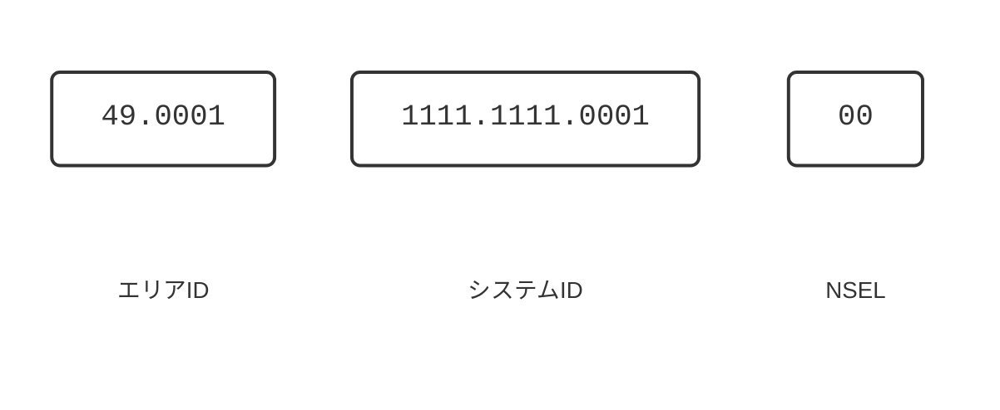
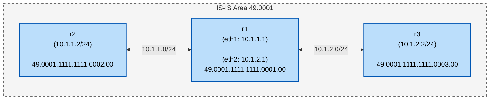

本記事は[いちぴろ・エクスプローラ Advent Calendar 2025](https://qiita.com/advent-calendar/2025/ichipiro-explorer) Day 15の記事です.

本記事では, 有名なルーティングプロトコルであるIS-IS(Intermediate System to Intermediate System)を触ってみた結果を書いていきます.

## はじめに
みなさんはネットワークの経路制御で用いられるルーティングプロトコルと聞くと何を思い浮かべますか？
OSPF, BGP, IS-IS, RIPなどがよく挙げられると思います.
OSPF, BGPなどは聴き馴染みのあるプロトコルであり, 使用したことがある人も多いと思います.
しかし, IS-ISはあまり目にする機会がないですよね.
そこで, 今回はIS-ISをFRRouting上で触ってみたいと思います.

## IS-ISとは？
IS-ISとはIGP(Internal Gateway Protocol)の一つで, 各ルータの接続状況をもとにして経路を決定するリンクステートアルゴリズムを用いるプロトコルです.
元々, OSI向けのルーティングプロトコルとして開発されましたが, TCP/IPにも対応したという経緯があります.
IS-ISは以下のRFCで規定されています.
- [RFC 1142](https://datatracker.ietf.org/doc/html/rfc1142): IS-ISプロトコルの規定 (別名: ISO/IEC DIS 10589)
  ※ [RFC 7142](https://datatracker.ietf.org/doc/html/rfc7142)に置き換えられたらしい
- [RFC 1195](https://datatracker.ietf.org/doc/html/rfc1195): Integrated IS-IS の規定
- [RFC 5308](https://datatracker.ietf.org/doc/html/rfc5308.html): IPv6対応

::: message
他にもあるっぽいんですが, 今回は割愛します...
:::

IS-ISは, OSPFと同様の階層ルーティングを採用しています.
OSPFではLSAですが, IS-ISではレベルルーティングを使用しているのが特徴的です.
IS-ISで用いられるルーティングのレベルは以下の通りです.
- level-1: 同一エリア内
- level-2-1: 同一エリア + 異なるエリア
- level-2-only: 異なるエリア間

また, IS-ISは元々OSIに準拠していたため, エリアを示すアドレスの記法が独特です.
ルーティングにはNSAP(Network Service Access Point)というアドレス記法を使っています.
NSAPアドレスは, エリアID, システムID, NSEL(NSAP Selector)の3つから構成され, 16進数表記で区切りにドット(.)が使われます.

例えば, `49.0001.1111.1111.0001.00`の場合は以下のようになります.


## 検証で使用するネットワーク構成
本検証では, IS-ISが動作するネットワークをcontaierlab上で構築します.

今回想定するネットワーク構成は以下の図に示す通りです.
なお, 今回はIS-ISの簡単な動作検証を行うので, 同一エリア(level-1)のみを対象とします.
<!-- ネットワーク構成図をmermaidで書く -->


今回はソフトウェアルータの一つであるFRRoutingを用いてIS-ISのconfigを作成していきます.
ここで気を付けることとして, FRRでIS-ISを使う場合, `isisd`を起動させる必要があるため, daemonsファイル内を以下のように変更します.
```diff Markdown:daemons
+ isisd=yes
- isisd=no
```

## 投入したコンフィグ
::: message
各ルータでは, `router isis 1`の定義をしてからインタフェースに`ip router isis 1`を設定してください.
:::

**r1**
```
frr version 10.1.1_git
frr defaults traditional
hostname r1
no ipv6 forwarding
service integrated-vtysh-config
!
interface eth1
 ip address 10.10.1.1/24
 ip router isis 1
exit
!
interface eth2
 ip address 10.10.2.1/24
 ip router isis 1
exit
!
router isis 1
 is-type level-1
 net 49.0001.1111.1111.0001.00
exit
```

**r2**
```
frr version 10.1.1_git
frr defaults traditional
hostname r2
no ipv6 forwarding
service integrated-vtysh-config
!
interface eth1
 ip address 10.10.1.2/24
 ip router isis 1
exit
!
router isis 1
 is-type level-1
 net 49.0001.1111.1111.0002.00
exit
```

**r3**
```
frr version 10.1.1_git
frr defaults traditional
hostname r3
no ipv6 forwarding
service integrated-vtysh-config
!
interface eth1
 ip address 10.10.2.2/24
 ip router isis 1
exit
!
router isis 1
 is-type level-1
 net 49.0001.1111.1111.0003.00
exit
```

## 動作検証

**pingによる疎通確認**
```
r2(config)# do ping 10.10.2.2
PING 10.10.2.2 (10.10.2.2): 56 data bytes
64 bytes from 10.10.2.2: seq=0 ttl=63 time=0.071 ms
64 bytes from 10.10.2.2: seq=1 ttl=63 time=0.054 ms
64 bytes from 10.10.2.2: seq=2 ttl=63 time=0.061 ms
^C
--- 10.10.2.2 ping statistics ---
3 packets transmitted, 3 packets received, 0% packet loss
round-trip min/avg/max = 0.054/0.062/0.071 ms
```

```
r3(config)# do ping 10.10.1.2
PING 10.10.1.2 (10.10.1.2): 56 data bytes
64 bytes from 10.10.1.2: seq=0 ttl=63 time=0.048 ms
64 bytes from 10.10.1.2: seq=1 ttl=63 time=0.058 ms
64 bytes from 10.10.1.2: seq=2 ttl=63 time=0.052 ms
^C
--- 10.10.1.2 ping statistics ---
3 packets transmitted, 3 packets received, 0% packet loss
round-trip min/avg/max = 0.048/0.052/0.058 ms
```

r2, r3それぞれからpingは通っていることが確認できました.
続いて, IS-ISが正常に動作しているか確認していきます
中央のルータで正常に経路交換ができているか確認するため, r1の挙動を見ます.

**IS-ISの挙動確認**

最初に, ネイバーの確認を行います. 
r1は隣接を正常に認識していますね.
```
r1(config)# do show isis neighbor 
Area 1:
 System Id           Interface   L  State         Holdtime SNPA
 r2                  eth1        1  Up            28       aac1.abf0.72fc
 r3                  eth2        1  Up            28       aac1.ab1f.1519
```
次に, インタフェースの状態を確認します. 
level-1(同一エリア内)できちんと接続できていますね.
```
r1(config)# do show isis interface 
Area 1:
  Interface   CircId   State    Type     Level
  eth1        0x20     Up       lan      L1       
  eth2        0x22     Up       lan      L1     
```
最後に, IS-ISのサマリーを確認していきます.
送信側(TX)も受信側(RX)も正常にパケットの送受信が行われていることがわかります.
```
r1(config)# do show isis summary 
vrf             : default
Process Id      : 32
System Id       : 1111.1111.0001
Up time         : 00:03:21 ago
Number of areas : 1
Area 1:
  Net: 49.0001.1111.1111.0001.00
  TX counters per PDU type:
     L1 IIH: 139
     L1 LSP: 9
    L1 CSNP: 16
    L1 PSNP: 1
   LSP RXMT: 0
  RX counters per PDU type:
     L1 IIH: 119
     L1 LSP: 5
    L1 CSNP: 19
    L1 PSNP: 1
  Drop counters per PDU type:
  Advertise high metrics: Disabled
  Level-1:
    LSP0 regenerated: 3
         LSPs purged: 0
    SPF:
      minimum interval  : 1
    IPv4 route computation:
      last run elapsed  : 00:02:06 ago
      last run duration : 68 usec
      run count         : 7
```

## まとめ
今回はIS-ISを触ってみました.
同じ距離ベクトル型IGPであるOSPFと比べるとあまり聞き馴染みのないプロトコルですが, 
割とシンプルな構造で触りやすい印象でした. 次はマルチエリアでの検証もやってみたいですね.
この記事がIS-ISというプロトコルに興味を持つきっかけになってもらえれば幸いです.

## 参考
https://docs.frrouting.org/en/latest/isisd.html#clicmd-redistribute-ipv4-ipv6-table-1-65535-level-1-level-2-metric-0-16777215-route-map-WORD
https://www.infraexpert.com/study/study28.html