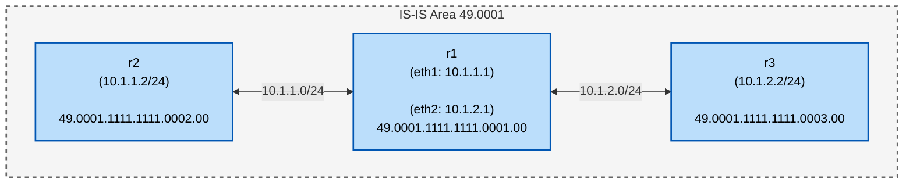

本記事は[いちぴろ・エクスプローラ Advent Calendar 2025](https://qiita.com/advent-calendar/2025/ichipiro-explorer) Day 15の記事です.

本記事は, 有名なルーティングプロトコルであるIS-IS(Intermediate System to Intermediate System)に触れて, その挙動を見るものになります.

## はじめに
みなさんはネットワークの経路制御で用いられるルーティングプロトコルと聞くと何を思い浮かべますか？
OSPF, BGP, RIP, etc...などがよく挙げられますよね.
他のテックブログでも上記のプロトコルを触ってみた系の記事はよく見かけます.
しかし, 上記のプロトコルと同じぐらいの知名度を誇るIS-ISを触ってみた記事はあまり目にする機会がないですよね.
そこで, 今回はIS-ISをFRRoutingを使って触ってみたいと思います.

## IS-ISとは？
IS-ISとはIGP(Internal Gateway Protocol)の一つで, 各ルータの接続状況をもとにして経路を決定するリンクステートアルゴリズムを用いるプロトコルです.
元々, OSI向けのルーティングプロトコルとして開発されましたが, TCP/IPにも対応したという経緯があります.
IS-ISに関連するRFCは以下
- RFC1195
- RFC5120
- RFC8202

IS-ISの特徴としては, ~~~
エリアに関しては以下から構成されます.
- level-1: 同一エリア内
- level-2-1: 同一エリア + 異なるエリア
- level-2-only: 異なるエリア間

海外のISPでよく使用されていることが知られていますが, 国内でもSRv6の注目を受けて話題に上がることも多くなってきた印象です.

## 検証で使用するネットワーク構成
本検証では, 以下のようなネットワークをcontaierlabで作成します.
なお, 今回はソフトウェアルータの一つであるFRRoutingを用いてconfigを作成します.

<!-- ネットワーク構成図をmermaidで書く -->

<!-- (r1 [eth1]: 10.1.1.1) -->
<!-- (r1 [eth2]: 10.1.2.1) -->

本記事はIS-ISの簡単な動作検証を行うので, 同一エリア(level-1)のみを対象とします.

<!-- ## 同一エリアの場合 -->

<!-- ### 投入したコンフィグ -->
## 投入したコンフィグ

**r1**
```
frr version 10.1.1_git
frr defaults traditional
hostname r1
no ipv6 forwarding
service integrated-vtysh-config
!
interface eth1
 ip address 10.10.1.1/24
 ip router isis 1
exit
!
interface eth2
 ip address 10.10.2.1/24
 ip router isis 1
exit
!
router isis 1
 is-type level-1
 net 49.0001.1111.1111.0001.00
exit
```

**r2**
```
frr version 10.1.1_git
frr defaults traditional
hostname r2
no ipv6 forwarding
service integrated-vtysh-config
!
interface eth1
 ip address 10.10.1.2/24
 ip router isis 1
exit
!
router isis 1
 is-type level-1
 net 49.0001.1111.1111.0002.00
exit
```

**r3**
```
frr version 10.1.1_git
frr defaults traditional
hostname r3
no ipv6 forwarding
service integrated-vtysh-config
!
interface eth1
 ip address 10.10.2.2/24
 ip router isis 1
exit
!
router isis 1
 is-type level-1
 net 49.0001.1111.1111.0003.00
exit
```

<!-- ### 動作検証 -->
## 動作検証

**r2 -> r3**
```
r2(config)# do ping 10.10.2.2
PING 10.10.2.2 (10.10.2.2): 56 data bytes
64 bytes from 10.10.2.2: seq=0 ttl=63 time=0.071 ms
64 bytes from 10.10.2.2: seq=1 ttl=63 time=0.054 ms
64 bytes from 10.10.2.2: seq=2 ttl=63 time=0.061 ms
^C
--- 10.10.2.2 ping statistics ---
3 packets transmitted, 3 packets received, 0% packet loss
round-trip min/avg/max = 0.054/0.062/0.071 ms
```

**r3 -> r2**
```
r3(config)# do ping 10.10.1.2
PING 10.10.1.2 (10.10.1.2): 56 data bytes
64 bytes from 10.10.1.2: seq=0 ttl=63 time=0.048 ms
64 bytes from 10.10.1.2: seq=1 ttl=63 time=0.058 ms
64 bytes from 10.10.1.2: seq=2 ttl=63 time=0.052 ms
^C
--- 10.10.1.2 ping statistics ---
3 packets transmitted, 3 packets received, 0% packet loss
round-trip min/avg/max = 0.048/0.052/0.058 ms
```

pingは通っていることが確認できました.
続いて, IS-ISが正常に動作しているか確認していきます
中央のルータで正常に経路交換ができているか確認するため, r1の挙動を見ます.

ネイバーの確認
```
r1(config)# do show isis neighbor 
Area 1:
 System Id           Interface   L  State         Holdtime SNPA
 r2                  eth1        1  Up            28       aac1.abf0.72fc
 r3                  eth2        1  Up            28       aac1.ab1f.1519
```
インタフェースの確認
```
r1(config)# do show isis interface 
Area 1:
  Interface   CircId   State    Type     Level
  eth1        0x20     Up       lan      L1       
  eth2        0x22     Up       lan      L1     
```
ルーティングの確認
```
r1(config)# do show isis route 
Area 1:
IS-IS paths to level-1 routers that speak IP
Vertex               Type         Metric Next-Hop             Interface Parent
r1                                                                    
10.10.1.0/24         IP internal  0                                     r1(4)
10.10.2.0/24         IP internal  0                                     r1(4)
r2                   TE-IS        10     r2                   eth1      r1(4)
r3                   TE-IS        10     r3                   eth2      r1(4)
r2                   pseudo_TE-IS 20     r2                   eth1      r2(4)
r1                                                                    
10.10.1.0/24         IP TE        20     r2                   eth1      r2(4)
10.10.2.0/24         IP TE        20     r3                   eth2      r3(4)

IS-IS L1 IPv4 routing table:

 Prefix        Metric  Interface  Nexthop    Label(s)  
 ------------------------------------------------------
 10.10.1.0/24  20      eth1       10.10.1.2  -         
 10.10.2.0/24  20      eth2       10.10.2.2  -         
```
サマリーの確認
```
r1(config)# do show isis summary 
vrf             : default
Process Id      : 32
System Id       : 1111.1111.0001
Up time         : 00:03:21 ago
Number of areas : 1
Area 1:
  Net: 49.0001.1111.1111.0001.00
  TX counters per PDU type:
     L1 IIH: 139
     L1 LSP: 9
    L1 CSNP: 16
    L1 PSNP: 1
   LSP RXMT: 0
  RX counters per PDU type:
     L1 IIH: 119
     L1 LSP: 5
    L1 CSNP: 19
    L1 PSNP: 1
  Drop counters per PDU type:
  Advertise high metrics: Disabled
  Level-1:
    LSP0 regenerated: 3
         LSPs purged: 0
    SPF:
      minimum interval  : 1
    IPv4 route computation:
      last run elapsed  : 00:02:06 ago
      last run duration : 68 usec
      run count         : 7
```

<!-- ## 異なるエリア間の場合 -->

<!-- ### 投入したコンフィグ -->

<!-- ### 動作検証 -->

## まとめ
今回はIS-ISを触ってみました.
同じ距離ベクトル型IGPであるOSPFと比べるとあまり聞き馴染みのないプロトコルですが, 意外とシンプルな構造になっていて触りやすい印象でした. 次はマルチエリアでの検証もやってみたいですね.
この記事がIS-ISというプロトコルに興味を持つきっかけになってもらえれば幸いです.
